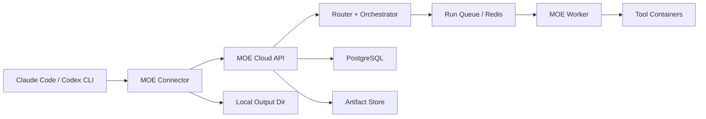
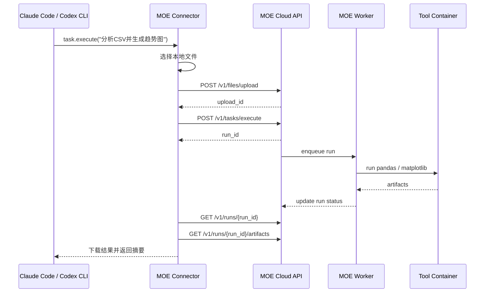

# MOE Toolkit 开发蓝图

文档版本：v2.0  
状态：可直接开工  
更新时间：2026-03-08

## 1. 文档目标

本文档将 MOE Toolkit 从“本地 Runtime + 本地执行”的旧方案，收敛为首版可交付的发布架构：

- 云端使用 Docker 形式持续运行核心服务
- 用户本地只安装轻代理与宿主接入组件
- 用户任务需要处理本地文件时，由本地轻代理显式选择并上传
- 云端负责路由、调度、执行、产物生成和工具镜像管理

本文档是首版的实现基线，后续文档、代码组织、部署、验收均以本文为准。

## 2. 首版产品定型

### 2.1 最终产品形态

首版产品由两部分组成：

- `MOE Cloud`
  - 部署在你的百度云服务器
  - 以单机 Docker Compose 方式运行
  - 对外提供 HTTP API 和任务执行能力
- `MOE Connector`
  - 安装在用户本地 macOS
  - 作为 Claude Code / Codex CLI 的本地轻代理
  - 负责 API Key 注入、文件上传、产物下载、健康检查

### 2.2 首版核心结论

- 不再要求用户本地安装工具链
- 不再要求用户本地运行 Docker 执行任务
- 不再要求用户本地保存工具 catalog 或 manifest 缓存
- 用户本地只保留配置、上传队列、下载产物和轻量会话状态
- 云端是执行面和控制面合一的服务端

### 2.3 首版不做

- 不支持用户自助上传新工具
- 不支持公开工具市场
- 不支持 Windows / Linux 客户端安装包
- 不支持 Cursor / Claude Desktop 首发接入
- 不支持 HTTPS 和域名首发
- 不支持高敏感数据处理

## 3. 服务器与运行环境

### 3.1 云服务器基线

云端部署固定参考：

- 文档：私有基础设施基线说明
- SSH 目标：`${MOE_REMOTE_HOST}`
- 系统：`Ubuntu 22.04 LTS`
- 部署目录：`/opt/moe-toolkit`

### 3.2 首版云端部署约束

必须满足以下约束：

- 所有应用服务必须运行在 Docker 容器内
- 首版以 `docker compose` 运行整套服务
- PostgreSQL 和 Redis 不开放公网
- 仅开放 `22` 和 `8080`
- 对外访问入口固定为 `${MOE_PUBLIC_BASE_URL}`

### 3.3 本地客户端基线

首版用户侧环境：

- macOS
- Claude Code 或 Codex CLI
- Shell 安装器
- 不要求用户自己配置 Python 项目环境

## 4. 总体架构



### 4.1 组件职责

| 组件 | 职责 |
| --- | --- |
| `MOE Connector` | 本地轻代理、宿主接入、文件上传、产物下载、配置与健康检查 |
| `MOE Cloud API` | 鉴权、任务创建、运行状态查询、registry 查询、telemetry 接收 |
| `Router + Orchestrator` | 意图识别、能力匹配、工具镜像选择、执行图生成 |
| `MOE Worker` | 从队列取任务，启动短生命周期工具容器并汇总结果 |
| `Tool Containers` | `pandas`、`matplotlib` 等能力镜像，完成实际任务 |
| `PostgreSQL` | API Key、运行记录、工具目录、推荐数据、telemetry 汇总 |
| `Artifact Store` | 上传文件、临时工作区、导出产物 |

## 5. 首版代码组织

首版工程结构固定如下：

```text
apps/
  cloud_api/
  cloud_worker/
  connector/
  admin_cli/
core/
  auth/
  routing/
  orchestration/
  uploads/
  artifacts/
  registry/
  telemetry/
schemas/
  api/
  tasks/
  registry/
deploy/
  docker/
    compose.dev.yml
    compose.prod.yml
    env/
docs/
  adrs/
  runbooks/
tools/
  curated/
    pandas/
    matplotlib/
    openpyxl/
scripts/
  install-connector.sh
  uninstall-connector.sh
```

### 5.1 模块职责

| 模块 | 职责 |
| --- | --- |
| `apps/cloud_api` | FastAPI 服务，暴露 REST API 和内部管理接口 |
| `apps/cloud_worker` | 消费运行任务，控制工具容器生命周期 |
| `apps/connector` | 本地轻代理、MCP 适配层、CLI 命令 |
| `apps/admin_cli` | 生成和吊销 API Key、同步 curated 工具、执行运维命令 |
| `core/routing` | 能力提取、路由评分、工具镜像选择 |
| `core/orchestration` | DAG 执行编排、任务状态更新、错误回传 |
| `core/uploads` | 上传、解压、目录清理、大小限制和过期删除 |
| `core/registry` | curated 工具镜像元数据、manifest、评分信息 |
| `core/telemetry` | 匿名 connector 事件和运行汇总 |

## 6. 云端 Docker 部署模型

### 6.1 Compose 栈

首版 Compose 服务固定如下：

| 服务名 | 说明 | 对外暴露 |
| --- | --- | --- |
| `moe-api` | FastAPI 网关 | `8080` |
| `moe-worker` | 异步任务执行进程 | 否 |
| `postgres` | 持久化数据库 | 否 |
| `redis` | 队列与短期状态缓存 | 否 |
| `cleanup-job` | 清理临时上传文件与过期产物 | 否 |

### 6.2 服务拓扑

```mermaid
flowchart TD
    A[公网 8080] --> B[moe-api]
    B --> C[postgres]
    B --> D[redis]
    D --> E[moe-worker]
    E --> F[docker.sock]
    E --> G[tool containers]
    B --> H[/opt/moe-toolkit/data/uploads]
    E --> I[/opt/moe-toolkit/data/artifacts]
    J[cleanup-job] --> H
    J --> I
```

### 6.3 服务器目录结构

服务器目录固定如下：

```text
/opt/moe-toolkit/
  compose/
    compose.prod.yml
    .env
  data/
    postgres/
    redis/
    uploads/
    artifacts/
    logs/
  releases/
  backups/
```

### 6.4 卷与网络

- `postgres` 数据卷：`/opt/moe-toolkit/data/postgres`
- `redis` 数据卷：`/opt/moe-toolkit/data/redis`
- 上传目录：`/opt/moe-toolkit/data/uploads`
- 产物目录：`/opt/moe-toolkit/data/artifacts`
- 日志目录：`/opt/moe-toolkit/data/logs`
- Compose 内部网络：`moe-internal`

### 6.5 Docker 运行规则

- `moe-api` 和 `moe-worker` 使用同一应用镜像，不同启动命令
- `moe-worker` 通过 Docker SDK 启动短生命周期工具容器
- `moe-worker` 需要挂载 `/var/run/docker.sock`
- 所有工具容器必须指定 CPU、内存和超时时间上限
- 首版工具容器不允许 `privileged`

## 7. 用户侧安装包设计

### 7.1 安装包形态

首版交付物固定为：

- `install-connector.sh`
- 本地命令 `moe-connector`

推荐安装入口：

```bash
curl -fsSL ${MOE_PUBLIC_BASE_URL}/install.sh | bash
```

这是 Beta 阶段的分发命令。待域名和 HTTPS 就绪后，再替换为正式安装入口。

### 7.2 `moe-connector` 必备命令

CLI 子命令固定如下：

- `moe-connector install --host claude-code|codex-cli`
- `moe-connector configure --server-url --api-key`
- `moe-connector doctor`
- `moe-connector uninstall`

### 7.3 安装器职责

安装脚本必须完成：

- 创建 `~/.moe-connector/`
- 写入 `config.toml`
- 创建本地输出目录 `~/MOE Outputs`
- 安装 `moe-connector` 可执行入口
- 调用宿主适配器，将 connector 注册进 Claude Code / Codex CLI
- 做一次 `/v1/service/health` 连通性测试

### 7.4 本地目录结构

```text
~/.moe-connector/
  config.toml
  logs/
  cache/
  tmp/
~/MOE Outputs/
```

### 7.5 本地配置

`ConnectorConfig` 固定字段：

- `server_url`
- `api_key`
- `host_client`
- `output_dir`
- `request_timeout_seconds`
- `max_upload_size_mb`

首版 API Key 直接保存在本地配置文件，权限要求为 `0600`。不做 Keychain 集成。

## 8. 文件处理策略

### 8.1 上传原则

- 用户只能上传本次任务明确指定的文件或目录
- 本地 connector 不允许透明扫描整个工作区
- 目录上传前由 connector 打包为 zip
- 上传后由云端生成 `upload_id`

### 8.2 云端留存策略

- 上传文件保存到 `/opt/moe-toolkit/data/uploads/{upload_id}`
- 任务运行期间和完成后 1 小时宽限期内允许读取
- 超过宽限期后由 `cleanup-job` 自动删除
- 产物下载后不做长期保留，默认同样进入清理队列

### 8.3 首版限制

- 单文件上限：`100 MB`
- 单次任务附件上限：`5` 个
- 首版只支持 CSV、TSV、XLSX、ZIP

## 9. 首版能力与工具镜像

### 9.1 首发场景

首版只打透一个强闭环：

- `分析 CSV 并生成趋势图`

### 9.2 首批 curated tool images

| image | 用途 | 主要能力 |
| --- | --- | --- |
| `moe-tool-pandas` | 读取和分析表格数据 | `csv_parse`, `data_analysis`, `data_transform` |
| `moe-tool-matplotlib` | 生成图表 | `visualization`, `report_export` |
| `moe-tool-openpyxl` | 导出 Excel | `spreadsheet_generate` |

### 9.3 路由能力标签

首版能力标签固定为：

- `csv_parse`
- `data_analysis`
- `data_transform`
- `visualization`
- `spreadsheet_generate`
- `route_explain`

### 9.4 执行原则

- `task.execute` 创建远程运行任务
- worker 生成临时工作目录
- tool container 顺序读取输入文件和中间结果
- 产物统一写入运行目录下的 `artifacts/`
- API 返回 `run_id`，由 connector 轮询并下载结果

## 10. API 与接口契约

### 10.1 本地 MCP tools

本地 connector 暴露以下 tools：

- `task.execute`
- `run.get_status`
- `run.get_artifacts`
- `service.health`
- `service.configure`

### 10.2 本地 CLI

本地 CLI 只负责安装、配置和诊断，不直接做任务执行编排。

### 10.3 云端公开 REST API

| Endpoint | 说明 |
| --- | --- |
| `POST /v1/files/upload` | 上传单文件或压缩包 |
| `POST /v1/tasks/execute` | 创建任务 |
| `GET /v1/runs/{run_id}` | 查询任务状态 |
| `GET /v1/runs/{run_id}/artifacts` | 获取产物列表和下载链接 |
| `GET /v1/service/health` | 健康检查 |
| `POST /v1/telemetry/connector-events` | 上报匿名 connector 事件 |

### 10.4 云端内部 API

| Endpoint | 说明 |
| --- | --- |
| `GET /v1/registry/tools/search` | 搜索 curated 工具 |
| `GET /v1/registry/tools/{tool_id}` | 获取工具详情 |
| `GET /v1/registry/manifests/{tool_id}/{version}` | 获取 manifest |

## 11. 关键类型

### 11.1 `ConnectorConfig`

| 字段 | 说明 |
| --- | --- |
| `server_url` | 云端 API 地址，首版默认 `${MOE_PUBLIC_BASE_URL}` |
| `api_key` | 每用户独立 API Key |
| `host_client` | `claude-code` 或 `codex-cli` |
| `output_dir` | 本地产物输出目录 |
| `request_timeout_seconds` | 请求超时时间 |
| `max_upload_size_mb` | 本地上传大小限制 |

### 11.2 `UploadRef`

| 字段 | 说明 |
| --- | --- |
| `upload_id` | 上传唯一标识 |
| `filename` | 原始文件名 |
| `size_bytes` | 文件大小 |
| `content_type` | 类型 |
| `expires_at` | 过期清理时间 |

### 11.3 `RemoteTaskRequest`

| 字段 | 说明 |
| --- | --- |
| `task` | 用户任务描述 |
| `attachments` | 上传文件引用列表 |
| `session_id` | 会话标识 |
| `output_preferences` | 输出格式偏好 |

### 11.4 `RoutePlan`

| 字段 | 说明 |
| --- | --- |
| `plan_id` | 路由计划 ID |
| `capabilities` | 识别出的能力标签 |
| `selected_images` | 选中的工具镜像 |
| `execution_steps` | DAG 或顺序步骤 |
| `explanation` | 路由说明 |

### 11.5 `ToolImageSpec`

| 字段 | 说明 |
| --- | --- |
| `tool_id` | 工具标识 |
| `image` | Docker 镜像名 |
| `version` | 镜像版本 |
| `capabilities` | 能力标签 |
| `entrypoint` | 容器执行入口 |
| `resource_limits` | 资源限制 |

### 11.6 `RunRecord`

| 字段 | 说明 |
| --- | --- |
| `run_id` | 任务 ID |
| `status` | `queued/running/success/failed` |
| `route_plan_id` | 关联路由计划 |
| `artifacts` | 结果文件列表 |
| `error_code` | 失败码 |
| `duration_ms` | 耗时 |

### 11.7 `ApiKeyRecord`

| 字段 | 说明 |
| --- | --- |
| `key_id` | Key 记录 ID |
| `owner_name` | 用户标识 |
| `status` | `active/revoked` |
| `created_at` | 创建时间 |
| `last_used_at` | 最近使用时间 |

### 11.8 `TelemetryEvent`

允许字段：

- connector 版本
- host 类型
- 平台信息
- 请求成功或失败
- 错误码
- 任务耗时

禁止字段：

- 用户原始 prompt
- 上传文件内容
- 产物内容
- 本地绝对路径

## 12. 鉴权与安全

### 12.1 鉴权

- 每个用户发放独立 API Key
- API Key 由 `admin_cli` 生成和吊销
- 所有对外 API 都要求 `Authorization: Bearer <api_key>`

### 12.2 网络与端口

安全组固定为：

- `22/TCP`：仅你的本地 IP
- `8080/TCP`：对 Beta 用户开放

严格禁止：

- `5432` 公网开放
- `6379` 公网开放
- 其他调试端口长期开放

### 12.3 容器安全

- 工具容器默认只挂载该次任务的临时工作目录
- 不允许宿主目录全量挂载
- worker 统一管理运行超时和资源上限
- 首版容器无特权模式

## 13. 关键工作流

### 13.1 用户任务闭环



### 13.2 失败处理

- 上传失败：connector 直接报错，不创建任务
- 任务创建失败：返回结构化错误和 request_id
- worker 执行失败：任务状态变为 `failed`
- tool container 超时：worker 终止容器并写入 `timeout`
- 产物下载失败：connector 提示用户重试拉取

## 14. 数据存储

### 14.1 PostgreSQL 表

| 表名 | 用途 |
| --- | --- |
| `api_keys` | API Key 管理 |
| `runs` | 任务运行主表 |
| `run_steps` | 任务步骤明细 |
| `uploads` | 上传文件记录 |
| `artifacts` | 产物记录 |
| `tool_images` | curated 工具镜像清单 |
| `route_plans` | 路由计划 |
| `telemetry_events` | 匿名事件 |

### 14.2 文件系统目录

- 上传目录：`/opt/moe-toolkit/data/uploads`
- 产物目录：`/opt/moe-toolkit/data/artifacts`
- 日志目录：`/opt/moe-toolkit/data/logs`

## 15. 阶段计划

### Phase 0：云端骨架（1 周）

目标：

- 建立 Compose 栈
- 打通 `moe-api + postgres + redis`
- 完成 `/v1/service/health`

退出标准：

- 服务器上 `docker compose up -d` 后服务可访问
- `${MOE_PUBLIC_BASE_URL}/v1/service/health` 返回正常

### Phase 1：本地 connector（1-2 周）

目标：

- 完成安装脚本
- 完成 `moe-connector configure/doctor`
- 完成 Claude Code / Codex CLI 接入

退出标准：

- 干净 macOS 机器完成安装
- API 连通、API Key、输出目录检查通过

### Phase 2：上传与远程执行（2 周）

目标：

- 完成 `files/upload`
- 完成 `tasks/execute`
- 完成 worker 拉起 `moe-tool-pandas`

退出标准：

- CSV 能上传并执行基础分析
- run 状态可轮询

### Phase 3：图表与产物回传（1-2 周）

目标：

- 增加 `moe-tool-matplotlib`
- 完成产物下载
- 打通“分析 CSV 并生成趋势图”

退出标准：

- 图表文件和摘要能落回本地输出目录

### Phase 4：Beta 发布（1 周）

目标：

- API Key 管理
- 清理任务
- 运维文档和安装文档

退出标准：

- 至少 1 个外部 Beta 用户可独立完成安装和使用

## 16. 测试与验收

### 16.1 安装验证

- 全新 macOS 机器执行安装脚本后生成本地配置
- `moe-connector doctor` 能检查 API 连通性、Key 状态、输出目录权限
- 注册宿主后可以看到本地 connector 工具

### 16.2 远程执行验证

- 上传 CSV 后 `task.execute` 返回 `run_id`
- `run.get_status` 能显示 `queued/running/success/failed`
- `run.get_artifacts` 能拉回图表和导出文件

### 16.3 安全验证

- 无效 API Key 返回 `401`
- 过期 `upload_id` 不可复用
- 上传文件在任务完成 1 小时后被删除
- `5432` 与 `6379` 无公网可达性

### 16.4 运维验证

- 重启 `moe-api` 后 `runs` 和 `api_keys` 不丢失
- `moe-worker` 崩溃后任务进入失败状态
- `redis` 或 `postgres` 不可用时健康检查返回降级状态

## 17. 运维与发布

### 17.1 发布顺序

1. 先交付云端 Compose 栈
2. 再交付 `moe-connector`
3. 再交付 curated tool images
4. 最后开放 Beta API Key

### 17.2 版本策略

- 云端 API 统一使用 `/v1/`
- connector 和 cloud 各自按 semver
- 首版只保证 `v1 connector <-> v1 API` 兼容

## 18. ADR

### ADR-001 远程云服务 + 本地轻代理

#### 决策

首版采用远程云执行，用户本地只保留轻代理。

#### 理由

- 交付体验更像“一键安装包”
- 用户无需本地准备工具和 Docker 环境
- 更适合以单一云基站维护工具镜像和路由逻辑

### ADR-002 单机 Docker Compose 首发

#### 决策

首版在单台百度云 Ubuntu 服务器上，以 Docker Compose 运行整套服务。

#### 理由

- 与当前服务器资源和运维能力匹配
- 比 Kubernetes 更轻
- 更适合 Beta 快速验证

### ADR-003 IP + 端口 + API Key 的 Beta 开放策略

#### 决策

首版直接使用 `${MOE_PUBLIC_BASE_URL}` 对外提供服务，使用每用户独立 API Key 控制访问。

#### 理由

- 先打通外部使用链路
- 暂不引入域名、HTTPS 和账号系统
- 将复杂度集中在任务闭环而非账户体系

## 19. 下一步实施顺序

按下面顺序开工，不再重新做架构决策：

1. 先写 `compose.prod.yml` 和 `moe-api` 健康检查
2. 再写 `moe-connector install/configure/doctor`
3. 再做上传接口和 `run` 状态机
4. 再做 worker 与 `moe-tool-pandas`
5. 再做图表产物下载
6. 最后做 API Key 管理、清理任务和 Beta 运维文档

这份蓝图是当前版本的唯一实施基线。
